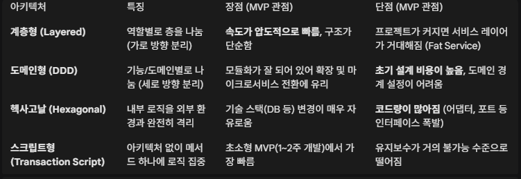

[서두]
- 엔티티 설계 관련 내용을 좀 책에서 접목시켜볼까 고민했다.
- 그래서 내 프로젝트에 접목시켜볼만한 부분들을 따로 뽑아내었고, 이걸 접목하려 노력해보았다. 
[내용]   
# 계층형 아키텍쳐
- 초기 mvp 개발에 유리한 구조 고민   
낮은 인지 부하, 빠른 구현 속도, 구현에 집중 후 도메인이 커지면 따로 떼어내서 독립시키는 전략을 취하기가 쉬움
보편성, DB 중심 설계의 편리함 (도메인 구조 변경 가능성이 많으므로), 낮은 학습 곡선
- 다른 대안들과 트레이드 오프

# 엔티티 설계
- 도메인에서 비즈니스 로직을 모두 결정하는 것의 이점
- 엔티티와 밸류 구분
- 밸류는 불변으로 구현, 참조 투명성
- enum은 불변인가? 아니라면 객체 불변성을 보장해야한다
- setter 안 좋다. setter는 불변성 보장도 깨지지만, 도메인 규칙을 위반한다는 것도 있다.
  상태 변경과 관련된 도메인 지식이 코드에서 사라지게 되는 것도 있다.
- 따라서 도메인 객체가 불완전한 상태로 사용되는 것을 막으려면 생성 시점에 필요한 것을 전달해주어야한다.
  즉, 생성자를 통해 필요한 데이터를 모두 받아야한다.
- 만약 개발 프레임워크나 도구가 set 메서드를 사용하지 않고 private 필드에 직접 값을 할당할 수 있다면 해당 기능을 최대한 활용하여 
불변의 장점을 dto까지 확장하자

[참고]   
https://msolo021015.medium.com/layered-architecture-deep-dive-c0a5f5a9aa37
https://techblog.woowahan.com/2561/
https://medium.com/daangn/%EC%95%84%ED%82%A4%ED%85%8D%EC%B2%98%EC%97%90-%EB%8C%80%ED%95%9C-%EA%B3%A0%EB%AF%BC%EC%9D%80-%EC%B2%98%EC%9D%8C%EC%9D%B4%EB%9D%BC-b75dffd73eb0